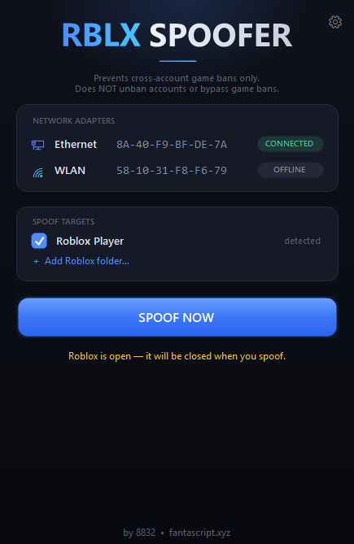
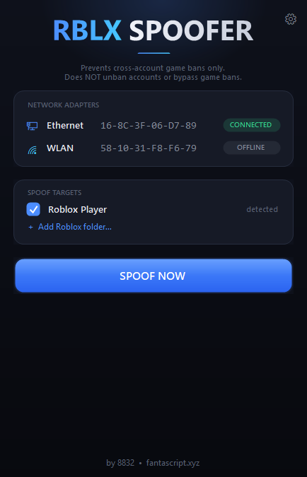
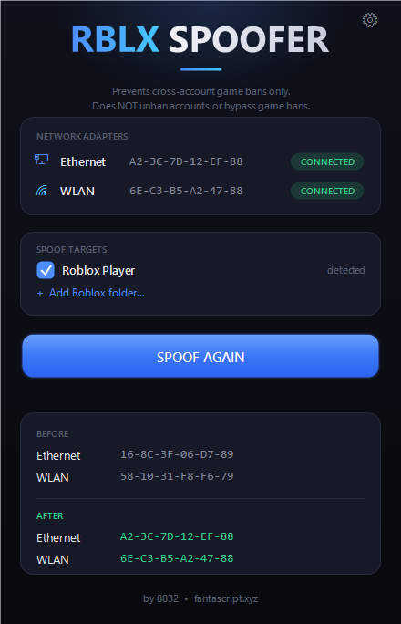
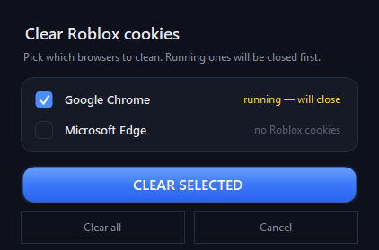

<h1 align="center">RBLX Spoofer</h1>

<p align="center">
  <b>A clean, open-source HWID / identity reset tool for Roblox.</b><br>
  Randomizes your MAC address and wipes the Roblox tracking data that links a device to a banned account —
  so a fresh account isn't instantly tied to your old one.
</p>

<p align="center">
  
  
  
  
</p>

<p align="center">
  
</p>

---

## What it does (in plain English)

Roblox can hand out **cross-account game bans** — you get banned in a game, make a new account, and get
banned again because the game recognizes your *device*, not just your account. RBLX Spoofer resets the
things on your PC that a game uses to recognize you:

1. **Randomizes your network MAC address** (the hardware ID of your Ethernet / Wi-Fi adapter).
2. **Wipes Roblox's local tracker cookie** (`RobloxCookies.dat`) so the client starts with a fresh identity.
3. **Deletes Roblox cookies from your browsers** — surgically, only `roblox.com` cookies, nothing else.

It does this with **one click**, in a clean GUI, with **no bundled dependencies** and **no data ever
leaving your PC**.

> ⚠️ **This does NOT unban accounts and does NOT bypass game-level bans.** It only prevents a *new*
> account from being linked to your old device fingerprint. See the [disclaimer](#-disclaimer).

---

## Features

- 🎯 **One-click spoof** — MAC + Roblox data + browser cookies in a single button.
- 🧠 **Surgical, not destructive** — only touches the tracker cookie, never your game settings or installs.
- 🌐 **Browser cookie cleaner** — finds `roblox.com` cookies across Chrome, Edge, Brave, Opera, Opera GX,
  Vivaldi and Firefox (all profiles) and deletes **only** those.
- 🔎 **Auto-detects installs** — standard Roblox, Microsoft Store version, Bloxstrap / Fishstrap, plus
  a **"+ Add folder"** option for portable / custom installs.
- ✅ **Pick your targets** — clean everything or just what you choose.
- 🧹 **Deep-clean toggle** — optionally also wipe cache / logs.
- 🪟 **Runs as a native app** — dark UI, status pills, no scary terminal.
- 📦 **Zero dependencies** — one `.exe`. Uses only built-in Windows APIs (including Windows' own SQLite).
- 🔓 **Fully open source** — build it yourself in one command and verify every line.

---

## Download & use (for everyone)

1. Go to the [**Releases**](../../releases) page and download `RobloxSpoofer.exe`.
2. **Right-click → Run as administrator** (it needs admin to change the MAC address).
3. Click **SPOOF NOW**.
4. When it's done, click **Delete them for me** and let it clear your browser cookies
   (it'll offer to close any open browsers first — save your work).
5. **Restart your PC** if it says a Wi-Fi adapter needs a reboot to apply.

That's it. Make your new account and you're good.

> Prefer not to trust a random `.exe`? Good instinct. [Build it yourself](#building-from-source) from the
> source in this repo — it's one command and the compiler ships with Windows.

---

## Screenshots

| Main window | After spoof | Cookie cleaner |
|:---:|:---:|:---:|
|  |  |  |

---

## How it works (the deep dive)

Everything below is exactly what the code does — no magic, no hidden network calls.

### 1. MAC address randomization

Every network adapter has a **MAC address** — a hardware ID that your router (and anything on the local
network) sees. The spoofer:

1. Finds your physical Ethernet and Wi-Fi adapters **by hardware type** (so it works whether Windows named
   them `Ethernet`, `Wi-Fi`, `WLAN`, `Ethernet 2`, etc.), skipping virtual/VPN/Bluetooth adapters.
2. Generates a random MAC with the **locally-administered bit set** and the **multicast bit cleared**
   (`first_octet = (rand & 0xFC) | 0x02`) — the format real network drivers accept.
3. Writes it to the adapter's driver key under
   `HKLM\SYSTEM\CurrentControlSet\Control\Class\{4d36e972-...}\<index>\NetworkAddress`.
4. Restarts the adapter so the new MAC takes effect immediately.

**Wi-Fi caveat (important):** some Wi-Fi chipsets/drivers simply **ignore** the `NetworkAddress` override —
there is no `Ndi\params\NetworkAddress` capability in their driver. The spoofer **detects this** and tells
you honestly (`driver can't spoof`) instead of pretending it worked. This is a hardware limitation that
*every* registry-based spoofer hits; there's no software fix. Ethernet almost always works.

### 2. Roblox identity reset

Roblox identifies a device mainly through a **tracker cookie**, not your MAC. That cookie lives at:

```
%LOCALAPPDATA%\Roblox\LocalStorage\RobloxCookies.dat
```

The spoofer **deletes that one file and recreates it empty** — nothing else in the folder is touched.
Your graphics settings (`GlobalBasicSettings`), app state, and installs stay exactly as they were.

It also handles, when present:
- The **Microsoft Store / UWP** version (separate cookie store under `Packages\...ROBLOX...`).
- **Bloxstrap / Fishstrap** — these launchers run the *same* Roblox client, so they share the cookie above;
  their own cache/logs are only touched on **deep clean**.
- **Custom folders** you add manually (validated so it won't add a folder that just shares the main cookie).
- The registry browser-tracker key `HKCU\Software\Roblox\...Browser...` **if it exists** — it deliberately
  leaves `HKCU\Software\ROBLOX Corporation` alone (that's app registration; deleting it breaks the launcher).

### 3. Browser cookie cleaning

After a spoof, Roblox's website session in your browser can still tie your new account to the old one, so
the tool offers to clear `roblox.com` cookies. Here's the honest engineering:

- Browsers store cookies in **SQLite databases** (Chromium: a `Cookies` DB, table `cookies`, column
  `host_key`; Firefox: `cookies.sqlite`, table `moz_cookies`, column `host`).
- To read/write them, the spoofer uses **`winsqlite3.dll`** — the SQLite engine **already built into
  Windows 10/11**. That's why there's **no bundled DLL and no external dependency**.
- Deletion is **surgical**: `DELETE FROM cookies WHERE host_key LIKE '%roblox%'`. It only removes
  roblox.com cookies. Every other site you're logged into is left untouched.
- **Detection** copies the DB (shared-read) and counts roblox cookies, so you see exactly how many exist
  per browser before you clear.

**Why it has to close your browser:** a running browser holds an exclusive lock on the cookie DB *and*
keeps cookies cached in memory — so even if you edited the file, the browser would overwrite your change on
exit. Closing first is the only way to make the deletion stick. The tool always **warns and asks first**
before closing anything.

> **Why not clear cookies while the browser is open?** The only ways to do that are the exact techniques
> info-stealer malware uses (reading cookies from process memory / DPAPI). Antivirus flags that behavior
> hard, and it wouldn't even delete reliably. This tool stays clean on purpose — that's why it asks you to
> close the browser instead.

---

## Building from source

No Visual Studio or .NET SDK needed — the C# compiler ships with Windows.

```bat
build.bat
```

Or manually:

```bat
%WINDIR%\Microsoft.NET\Framework64\v4.0.30319\csc.exe /target:winexe /out:RobloxSpoofer.exe ^
    /win32icon:logo.ico /reference:System.Windows.Forms.dll /reference:System.Drawing.dll ^
    /reference:System.dll SpooferApp.cs
```

The entire program is a single file: [`SpooferApp.cs`](SpooferApp.cs). Read it, audit it, change it.

---

## FAQ

**Is this a virus? My antivirus flagged it.**
No. It's open source — read every line. But antivirus *will* sometimes flag MAC changers and cookie
cleaners as "HackTool"/"PUA" because they modify system settings and browser data (the same actions malware
does, even though this tool does them cleanly and locally). If you don't trust the prebuilt `.exe`,
**build it yourself** — it's one command and the source is right here.

**Does the Wi-Fi spoof always work?**
No — and no tool can guarantee it. Some Wi-Fi drivers ignore MAC overrides at the hardware level. The app
tells you honestly when your adapter can't be spoofed. Ethernet almost always works. Since Roblox tracks
the cookie more than the MAC, this rarely matters.

**Will this unban my account?**
No. It resets your *device* fingerprint so a **new** account isn't auto-linked to your old one. It does not
touch account-level or game-level bans.

**Does it delete all my cookies / log me out of everything?**
No. It deletes **only** `roblox.com` cookies. Every other login stays.

**Multiple browser profiles?**
Yes — it scans and clears every profile (Default, Profile 1, 2, …).

**Do I need to run it every time?**
Only when you want a fresh device identity (e.g., before making a new account after a ban).

---

## ⚠️ Disclaimer

This project is provided **for educational purposes** and as a privacy/system utility. Using it to evade
bans **violates Roblox's Terms of Service** and **can result in account termination**. You are solely
responsible for how you use it. The author provides no warranty and accepts no liability for any
consequences, including account or hardware issues. If you don't accept that, don't use it.

This tool is **not affiliated with, endorsed by, or connected to Roblox Corporation** in any way.

---

## Credits

Made by [**8832**](https://discord.gg/P9dEKq5Emd) · [fantascript.xyz](https://fantascript.xyz)

Licensed under the [MIT License](LICENSE).
